# Modern Web Development

> Frontend - React - Single Page App - TypeScript - NPM - Visual Studio Code

## Intro

So you learnt the syntax of JavaScript and maybe some basic standard library
stuff like `Math.*` and `document.*` functions.

That's not even half the battle. Fortunately, those skills are transferrable to
other languages however there is a core concept that spans most languages but
is, in practice, unique to each: Ecosystem.

This refers to a number of things:

*   Tools used to write, test and deploy code
*   "Packages" and the economy of shared code or "Open Source Software"
*   Tools to _share_ and _use shared_ code

This will be very in depth and will involve lots of reading and large blocks of
text. I have made as much as possible interactive with ways to "play along" and
type commands and build things but some of the early things unfortunately have
no way to do this but they **_are_** important, like _very_ so I just had to
include them and you should read them.

Key words are in **bold** and are worth googling (sometimes with context) to
learn more.

Enjoy!

## Modern Web Tech

There are roughly three phases of "the web" - which primarily refers to internet
browsers and pages etc. It's in no way a exhaustive list and it's not _quite_ in
complete chronological order but it outlines the three most prominent stages
that the web took over the past 3-ish decades.

Some words I will explain after, there will likely be things you don't know.

1.  The old web consisted of static HTML files known as "documents" because
    that's what they were, they were documents. They looked like the kind of
    thing you'd print out and put in an envelope and send to your local
    newspaper.

    This type of web consisted of a basic model where a user would **request** a
    document by using a **universal resource locator** path which a **HTTP
    server** would receive and use that URL path to look up an actual file on
    the server's hard drive then read that document and send back a **response**
    with the document in the **response body**. This is known as "Static" pages.

    That was it. No infinite scroll, no notifications and no cool 3D rendering!

    There were also `<form>` elements in HTML which allowed users to submit
    information to the **HTTP server** - very basic and pretty much fit the
    vocabulary of "document" and "form" - very boring and dull.

2.  Then came things like JavaScript and being able to run basic code in web
    pages. This meant a page could have animations and other fun stuff. But it
    wasn't interesting until AJAX and Web 2.0 (Read more
    [here](https://en.wikipedia.org/wiki/Web_2.0))

    One of the core differences in this phase was the fact that server-side
    software wasn't just serving HTML files from the hard drive. Instead, web
    server software was actually generating this HTML data on-the-fly depending
    on the user's request. This is known as "Dynamic" Pages/HTML/content and
    this was how search results pages and user-content sites worked (like Google
    and MySpace, etc).

    A quick example of this would be a basic search feature on a site that would
    request the URL: `http://website.com/search?q=cats` the `?q=cats` part tells
    the web server the search term the user typed and that controls how the HTTP
    server generates the HTML document to respond with.

3.  This is when things got interesting. JavaScript was already in heavy use
    during this phase which turned these old "documents" into miniature pieces
    of software that ran in the browser.

    The core milestone here is that these pieces of software had the ability to
    send additional **HTTP Requests** to acquire further data. This means a
    single web page the user loads once can then run a repeating timer every 10
    seconds that would further request some data that would update the page.

    In addition to that, something called "WebSockets" came along and removed
    the need for web pages to even request further data, WebSockets allowed the
    server to simply _send_ data _to_ the client without it even asking. This is
    how most modern notifications (Facebook chat, etc) work.

### Some Terms

So there was a lot of info in there, I'll break down some abbreviations and
terms used.

#### HTTP

What this stands for doesn't matter, you can wikipedia that and you'll still
have no idea what it means.

HTTP is a specification, a standard, a document. It's not a _thing_ it's a set
of rules. This is very common in tech, so you'll come across the words "spec",
"protocol" and "standard" a lot. Most of the time, a collection of clever people
will come up with a very useful technology and design it purely in very detailed
writing then release the document and have other people actually build software
and tools that **implement** the spec.

So HTTP is a specification for a **protocol**. This protocol is a specific way
of sending data over a TCP socket. Now this is about the depth limit I will go -
otherwise this would turn into a book... Go wikipedia TCP if you want to know
more, in short it's just a way of getting data from one machine to another using
an IP address. That's all you need to know.

HTTP is designed for getting _content_ (originally documents) from web servers
to browsers (or "clients"). A **HTTP Server** is a piece of software that runs
on a server machine ("server farm", "data centre", etc) and **listens** for
connections on port 80 and 443 (these are standard ports for HTTP and HTTPS
respectively). When you request a document, your computer is opening a
connection to the website's server machine on port 80 or 443 (443 is the port
used for encrypted communication over HTTPS - yes the S effectively stands for
"Secure").

A very basic HTTP server would receive the URL you sent, lets say:
`website.com/jim/my_blog.html` and it would chop off the website bit and use the
rest as a hard drive path to look up that specific file, lets say
`C:\my_website\jim\my_blog.html`.

And a more complex HTTP server would generate a HTML page based on the contents
of a database and then respond with that - without ever touching the hard drive.

#### Request and Response

These are commonly used words to describe the browser/client/user making a
**request** which actually refers to a **HTTP Request** which is part of the
HTTP Spec. A HTTP Request consists of a set of information that describes what
the user wants. This includes the URL, maybe some cookies, a **method** which is
a verb such as "get" or "put" that describes _what_ the user wants to do.

A Response is what the HTTP Server sends back, which look similar and can
include additional information alongside the "body" which usually contains the
actual HTML of a web page. Additional information can include cookies that the
browser must save, a "Content-Type" that tells the browser what kind of document
it is - it's not always HTML!

### Specs, Guidelines and Workarounds

A lot of the web is based on specifications. JavaScript, HTML, HTTP, CSS - all
these and more are based on specifications, which I briefly touched on in the
HTTP section.

This means there's a lot of rule-following and conforming to these
specifications. But it also means some of those rules can be bent and the
technologies can be adapted to perform tasks they weren't originally designed to
do. This isn't always a good thing.

Take for example website layouts. The CSS system was _never_ originally designed
to do some of the things it does but people found strange quirks in the way
elements would sit next to each other if you used just the right combination of
CSS properties in just the right way.

This was a huge problem because different browsers represented them differently,
hence the pain of testing on Chrome, Firefox, IE and all the other browsers.
This pain only got worse when mobiles entered the fray.

This is important to know because you will come across a lot of bad habits
(considered bad nowadays but back then it was the only way!) especially on
forums and StackOverflow.

## Core Tools

So this is where things start to get more interactive, now that wall of text is
over. I'll start showing you the tools and explaining why such things exist and
why certain workflows are the way they are.

One thing to remember is most of the specifics (such as text editor) are
personal preference and you may find other things that work for you in future.
**However**, with that said, since you're reading this, you're a beginner. That
means you should focus on the concepts behind these tools instead of the tools
themselves. I've tested many different tools and workflows over the years and
these are what I deem to be the objective _best_ tools for the job _currently_.
Once you're more experienced you can experiment and prove me wrong but so far,
these are what I've found to be the most optimal way to do the things I do.

### A Side Note regarding "Command Line tools"

Most of what you're about to install are considered "Command Line"
applications/programs/tools/apps/etc. What is meant by "Command Line" is the
PowerShell/CMD/Bash terminal - that is also known as a "command line" (hence the
name "Command Prompt" on Windows, also known simply as "cmd")

A "Command Line" tool is typically an app you run by typing its name into a
shell. `git` is a perfect example of a command line tool. The only way you
interact with git is by executing it.

Typically, command line tools do _one thing_ at a time then exit. They don't run
in the background or open in a window or do anything like that, they do what
they are asked and then they exit.

When you typed `git` in the terminal above, the default behaviour is to print
out the short help message and exit. Most other actions with most other command
line apps follow this pattern of being executed and then immediately exiting.

I'm explaining this because it's probably quite a new concept to those of you
who are used to using apps with graphical interfaces. You open up Google Chrome
and browse the internet, you don't open up Chrome with a specific instruction to
display facebook.com for 5 seconds then exit immediately.

### Node.js

https://nodejs.org/en/ - side note: get LTS, LTS means "Long Term Support" which
means minimal bugs and it'll be stable for a long time.

Node.js is a piece of software that allows JavaScript to be run outside of a web
browser and provides features similar to most other programming languages such
as access to system resources like files and networks.

Normally, the only thing that runs JavaScript on your computer would be your
browser. When you visit a page, it downloads any necessary .js files and
executes them when necessary (usually triggered by events such as `onClick`
etc.)

Node.js allows you to write JavaScript in a standalone way as if it were C++ or
some other regular programming language. When Node.js was released, the tech
world started to build websites _entirely_ in JavaScript. That means the HTTP
Servers would be written in JS and the browser code would be in JS - this was
great news for JavaScript programmers as it just meant more jobs!

When you install it, take note of the "Add to PATH" bit:

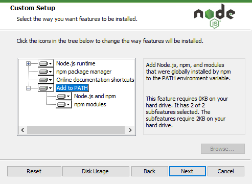

I will refer back to this in a later section because it's an important concept
to understand!

#### JavaScript vs Java vs ECMAScript

This needs to be mentioned. So many people get Java and JavaScript confused and
that's fair enough (even though all programmers ever will laugh at you for that
confusion).

Read the History section of the JavaScript page to get the full picture but just
remember:

JavaScript is nothing to do with Java itself - the reason JavaScript was named
that way is partially a mystery but most likely an attempt at gaining popularity
when it was first introduced.

ECMAScript (or simply "ES") is the more widely accepted name. JavaScript is an
implementation of ES and ES aims to help bridge the gap between different
versions of very similar languages (like ActionScript and JScript... confusing I
know)

You will often see people refer to "ES5", "ES6" which are different versions of
ECMAScript. I will discuss this further later in the document when it's a bit
more relevant and in context.

Hopefully that didn't confuse you more.

### git bash

If you install "Git for Windows" it should come with git bash.

https://git-scm.com/downloads

Wtf is a git bash? Don't worry, it's not a hate crime, it's a Windows
implementation of the Bash tool. "Bash" is short for "**B**orne **A**gain
**Sh**ell" and has a long history behind it that you don't need to know right
now. The git part is just because it comes packaged with Git.

What's a "Shell"? A Shell is a software interface to a computer's operating
system. It's called a shell because it's the outer-most layer.

*   Command Prompt is a Shell, it's shit.
*   PowerShell is a shell, obviously
*   Bash, Zsh, Fish are all shells

If you're on Windows, you'll have Command Prompt (often called CMD) or
PowerShell available. I'm telling you to install git bash because it provides a
more Unix way of interacting with your machine.

Why is unix important? Because most of the world runs on it. Not your home
computers but servers that run websites that would cause mass panic if they
disappeared. Unix is very important and thus, a very important tool to learn how
to use. That's a whole other topic but using Bash is a good start!

Side note: there's basically no difference between Bash and CMD/PowerShell when
you're just typing commands - the advantages will become apparent later on
though.

### vscode

There are many editors out there, I won't bore you with justifications, vscode
is just very good so use it.

https://code.visualstudio.com

## Quick Overview of `what this means` and what "Run" means

When I write things in `inline code blocks` it usually refers to a term or
phrase in context of either:

*   A programming language
*   A shell
*   Something technical or mathematical

This is common in technical documentation.

If I say "run this" or "run `something in an inline code block`" it always means
"type this thing into a shell such as bash or cmd or powershell".

### That "Add to PATH" Thing I Mentioned

You're probably wondering why I pointed that little detail of an installer out
and why PATH is in capitals.

What this is referring to is an **environment variable** named `PATH` (well on
Windows it's usually named `Path` but on Unix it's always uppercase, anyway case
doesn't matter) the importance of this is too great to not devote an entire
section to its significance.

The reason you can type `git` or `notepad` - or any of the hundreds of
commands - and get a response is because the operating system knows _where_ to
find these applications. When you type `git` the shell is actually _executing_ a
program named `git.exe`. How does it know _where_ `git.exe` is located? PATH!

As I said, `PATH` is an **environment variable** which is essentially a global
variable that's so global, the entire operating system and all the programs
inside it can access it. There are lots of environment variables on any
operating system (Windows and Unix both use environment variables) and you can
see them by either typing `SET` in a **Command Prompt** window. For some reason
this only works in Command Prompt:

```bash
C:\Users\Southclaw>set
ACLOCAL_PATH=C:\Program Files\Git\mingw64\share\aclocal;C:\Program Files\Git\usr\share\aclocal
ADSK_CLM_WPAD_PROXY_CHECK=FALSE
ALLUSERSPROFILE=C:\ProgramData
ANSICON=148x1000 (148x42)
ANSICON_DEF=7
APPDATA=C:\Users\Southclaw\AppData\Roaming

(and it goes on... and on... and on...)
```

Anyway, back to `PATH` and its significance. The whole reason `PATH` exists is
to store a list of directories that contain applications. So when you type
_anything_ at a prompt, the shell will load the `PATH` variable then look at
each directory that it contains and check if any of those directories contain a
`.exe` file that matches what you typed.

You can view your `PATH` variable contents in two ways:

1.  typing `echo %PATH%` in a command prompt
2.  opening Start, searching for `Environment Variables`

    clicking on

    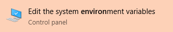

    then clicking on

    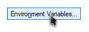

    then double clicking on

    

    then you can see a nice list of directories that exist within the `PATH`
    variable.

## vscode first steps

Okay we're _almost_ to the point of **_Actually Doing Things™_**

Open up vscode and behold it's beauty. You can press `CTRL+K, CTRL+T` to change
the colour scheme. When I write two keyboard shortcuts one after the other
separated by a comma in a single `inline code block` that means you do them in
sequence, one after the other. If both shortcuts contain the same modifier (such
as `CTRL`) then just keep that held down and, in this case, press `K`, release
it (while still holding `CTRL`) then press `T` and a menu will appear.

Much of software engineering is driven by the keyboard, you will very rarely
touch the mouse (which is healthy for your wrist) because most of the tasks you
need to do can be done from the keyboard. And doing things from the keyboard is
often much faster than doing it with a mouse.

Press `CTRL+Shift+P` to open up the **Command Palette**.

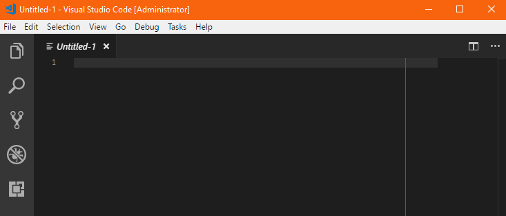

This is **mission control** of vscode, this is where you access almost all the
functionality of both the editor and the language-specific extensions.

Now with the **Command Palette** open, type `viewterminal` and you'll see the
option `View: Toggle Integrated Terminal`. Hit Enter to show a terminal.

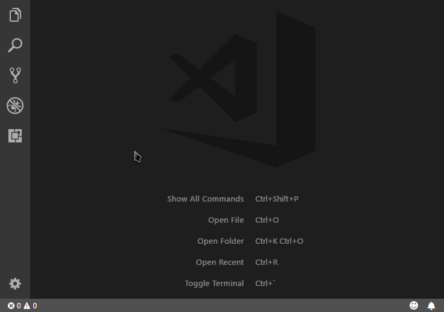

Notice how you only need to type a small amount of characters to get a command
to show. The **Command Palette** is clever and uses all sorts of useful
algorithms to make sure you do as little typing as possible. Commands are ranked
by how often they are used so if you run this command a lot, you'll eventually
only have to type `view` or something.

You should now see something like this:

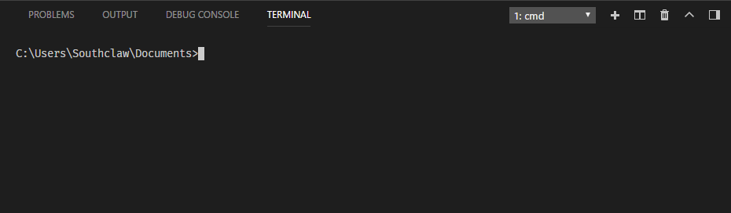

Or maybe this if you're using CMD as the default terminal (Windows 10 changed
the default some time in 2017 I think).

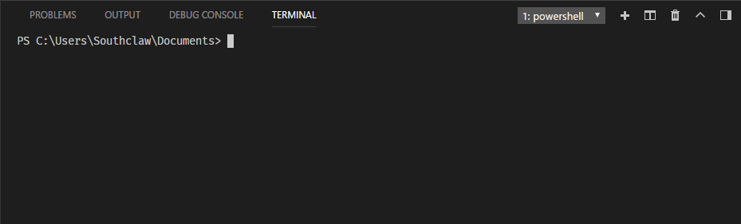

There's a problem though, this terminal is using Command Prompt or PowerShell as
the default because that's what Windows has installed by default. You are going
to change this in settings by hitting `CTRL+,` and searching for
`terminal.integrated.shell.windows`:

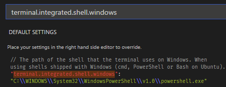

Then copying the default to your own settings:

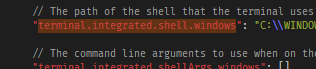

And then switching what's already in the quotes to the right for
`C:/Program Files/Git/bin/bash.exe`. This is the default installation path for
Git's version of Bash, the only way I think this can change is if you install
the 32 bit version of it, in which case the path will be in
`Program Files (x86)`. You can always navigate to this folder just to check
anyway.

Once you've done that, and saved the settings file with `CTRL+S`, delete the
terminal that you already opened by clicking  and open a new
one. (but this time use the keyboard shortcut for opening the terminal, It's
CTRL+` which is that weird apostrophe character to the left of 1 on the
keyboard, just above Tab)

Great, now you should see this:

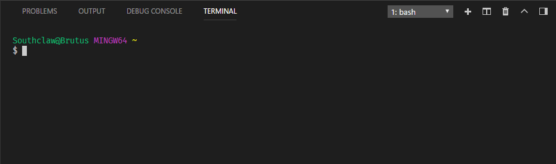 _it also has
pretty colours!_

You can type `nodepad.exe` to open up Windows notepad then close it because
you'll never use that program again.

Type `git` and if everything has gone well so far, you'll see some (un) helpful
message from Git attempting to explain how to use it. It'll look similar to
this:

```bash
usage: git [--version] [--help] [-C <path>] [-c name=value]
           [--exec-path[=<path>]] [--html-path] [--man-path] [--info-path]
           [-p | --paginate | --no-pager] [--no-replace-objects] [--bare]
           [--git-dir=<path>] [--work-tree=<path>] [--namespace=<name>]
           <command> [<args>]

(followed by more documentation for how git works)
```

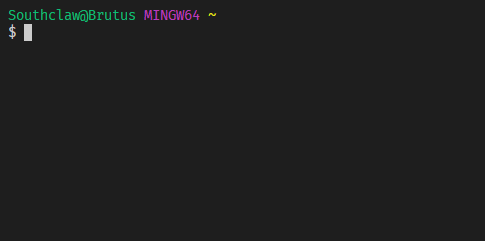

## Creating a React App with TypeScript

Now you have an editor and a shell set up, it's time to create directory for the
project and then turn that directory into an _npm package_. To make sure you
have `npm` (I'll explain what that is shortly) installed properly (it comes with
Node.js) run `npm --version` on the terminal and you should see:

```bash
5.3.0
```


The version number will probably differ to that depending on when you read this.

If nothing comes up, I'm not prepared for that, shoot me an email/open a github
issue/tweet me/discord me/etc and I'll figure out why that happened and how this
section of the tutorial can be improved!

(side note: because I have all of this stuff already installed, it's hard to
truly go through the "first time" user experience and catch a lot of these
little issues, so apologies!)

### Setting up the Project Workspace

Like most things (things meaning video editing projects, 3D projects, music,
etc) you group project files into a directory. Most programming languages use
directories, not only as a means of grouping files but also as the primary way
of packaging and managing code.

For example, to create a new npm package you'd type `npm init` which would
create the necessary files in your current directory. And likewise, vscode
doesn't just "open" files, it "opens" directories too and this helps extensions
understand where all your files are located in order to provide useful tools
that you'll discover later on.

#### Directory Paths Primer

Like I just mentioned, you can execute `npm init` by typing it into your
terminal. _But don't do it just yet!_ If you look at the terminal, you'll notice
something like

```bash
userName@computerName MINGW64 ~
```

This is called the "prompt". It's called that because it, quite literally, is
prompting you to enter a command (oldschool terminology has a way of sticking
around in computing). This describes your shell's state including the user who
is logged in (`userName`) the name of the computer you're logged into
(`computerName`) and `MINGW64` which isn't important in any way right now (it's
the name of the underlying implementation of Bash on this platform, see I told
you it wasn't important).

Another important thing to know about shells is that they have a _position_. By
that I mean, an instance of a shell _runs_ in a particular directory on your
hard drive. Bash defaults to your _home directory_ which, on Windows, is located
at `C:\Users\YourName`. This is exactly what `~` means at the end of this line.
This is an old Unix convention where `~` is a special character used only at the
beginning of directory paths that always refers to your "home directory".

Now if you were to run `npm init` right here, you'd turn your entire user
directory into an npm package. I can bet right now you don't want to do that if
you have any semblance of organisation in your computer's file system. So what
you need to do is change your shell's **current working directory** to another
location on your drive.

You do this by typing `cd` followed by a **directory path**. A **directory
path** can be **absolute** or **relative**.

The difference between absolute and relative is very important and you'll
instantly understand once you're shown some examples and try it out for yourself
and gain an intuition for navigating file systems without a graphical browser
like Windows Explorer.

So, lets say you've just opened an integrated terminal in vscode. If you run
`pwd`, this is a very simple program that will simply print out the **current
working directory**. "pwd" stands for "print working directory" and it's an old
Unix tool.

You should see something like:

```bash
/c/Users/UserName
```

Which shows you that you're on the `C:\` drive and you're currently in the
directory `UserName` which is inside `Users`.

I'm going to assume you have a typical Windows layout - so your user folder
should contain a folder named `Documents` - if this is not the case, just open
up your user folder and look for another folder to use for this demo.

Type `cd Documents` that will **c**hange **d**irectory to your `Documents`
directory. The `Documents` part of that command is a _path_, more specifically
it's a **_relative_ path**, relative to your current directory. Also, you'll
notice the prompt has changed to:

```bash
userName@computerName MINGW64 ~/Documents
```

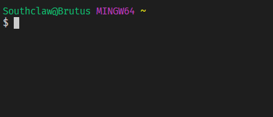

You could achieve the exact same outcome by typing
`cd /c/Users/UserName/Documents` but that's a lot of typing so most of the time
you can just use relative paths.

But what if you want to go to the directory that _contains_ your current
directory, wouldn't you have to type `cd /c/Users`? _No_ just type `cd ..` - Now
the `..` in that example is special directory path notation and it means **up
one level**.

The reason it means "up" is because directory systems are considered a _tree_
and most people visualise trees as growing downward, like this:

```bash
/c/
├── OtherStuff/
└── Users/
    ├── Bob/
    │   └── Documents/
    └── UserName/
        ├── Documents/
        ├── Music/
        └── Pictures/
```

So imagine, if you are here:

```bash
/c/
├── OtherStuff/
└── Users/
    ├── Bob/
    │   └── Documents/
    └── UserName/ <<< HERE!
        ├── Documents/
        ├── Music/
        └── Pictures/
```

And you go "up" then you end up here:

```bash
/c/
├── OtherStuff/
└── Users/ <<< HERE
    ├── Bob/
    │   └── Documents/
    └── UserName/
        ├── Documents/
        ├── Music/
        └── Pictures/
```

Because `Users` is the directory that _contains_ `UserName`. Another word for
this would be _parent_ directory. And, you might have guessed that the
directories _inside_ a parent directory are the _children_. And, keeping with
the kinship terminology, folders that are _beside_ each other in the tree are
_siblings_. So here, `UserName` and `Bob` are siblings of each other and
children of `Users`.

#### Create a Folder

So now you know the basics of directories, you need to `cd` to a place where you
want to create your React project. You could `cd` to your Documents and make it
there. For that you can just `mkdir MyNewCoolDirectory` and that will create a
directory in your current working directory.

If you did `cd Documents` from your User folder, so you're here:

```bash
/c/
├── OtherStuff/
└── Users/
    ├── Bob/
    │   └── Documents/
    └── UserName/
        ├── Documents/ <<< HERE!
        ├── Music/
        └── Pictures/
```

And then you typed `mkdir MyNewCoolDirectory` then your directory tree would
expand:

```bash
/c/
├── OtherStuff/
└── Users/
    ├── Bob/
    │   └── Documents/
    └── UserName/
        ├── Documents/
            └── MyNewCoolDirectory/
        ├── Music/
        └── Pictures/
```

Then you could `cd MyNewCoolDirectory` and then move to the next bit.

also notice how typing `mkdir` is _way_ faster than

*   opening a folder in explorer
*   right clicking in some blank space
*   hovering over "new" until the other menu appears
*   moving your mouse to the new menu
*   missing slightly so the menu closes
*   doing it again
*   clicking "New Folder"
*   typing a name once the folder appears

#### Finally Creating an _Actual App!_

Now that you're in `MyNewCoolDirectory` or whatever you called it (henceforth
referred to as the _project directory_ or _workspace_) you can now run
`npm init`. Where `npm` is the normal node package manager app and `init` is a
subcommand that means "**init**ialise a new package".

The tool will then quiz you for some details on your new package. Most of the
fields you can just ignore by pressing `ENTER`.

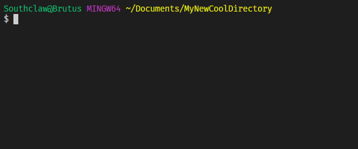

It doesn't matter what you name it as you can always rename it later so in the
example I'll name it `new-project-yay`. Once you run the command, a new file
will be created in that directory. You can view the contents of that directory
by typing `ls`:

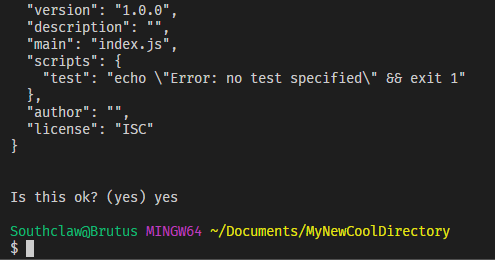

#### Packages and Ecosystems

npm isn't just a command line tool, it's also a service that provides public
storage of _packages_.

Back in The Day™ you'd write code then run it. Nowadays, no one has time to
write code, so everyone just uses code that other people have written. This is
where a **Package Ecosystem** comes in.

I'll elaborate on that first sentence. In earlier times of software development,
companies or individuals would often write _all_ their code themselves. There
was very little sharing (You had to pay $40 for a C compiler in the 70's!).

On top of that, using someone else's (or some other company's) code was awkward.
Because most languages were compiled and there were so many different types of
CPU architecture, it was very difficult to grab some source code files and
integrate them into your own codebase.

Nowadays, most computers are the same under-the-hood and a lot of our
programming languages do some really clever things to help make sharing code
much easier. Sharing code is incredibly important to prevent developers from
re-writing the same old thing that has been written thousands of times before.

So, that brings us to `npm`. NPM stands for "Node Package Manager" and is a
**Package Manager** for JavaScript. Lots of languages have Package Managers and
they usually do three things:

*   Provide developers with a way to share code they have written so that they
    can get recognition for their work and build a portfolio
*   Provide users with a way to easily acquire code that has been shared by
    others and use it in their own code
*   Provide additional tools and useful things that can make the entire
    development process a bit easier
